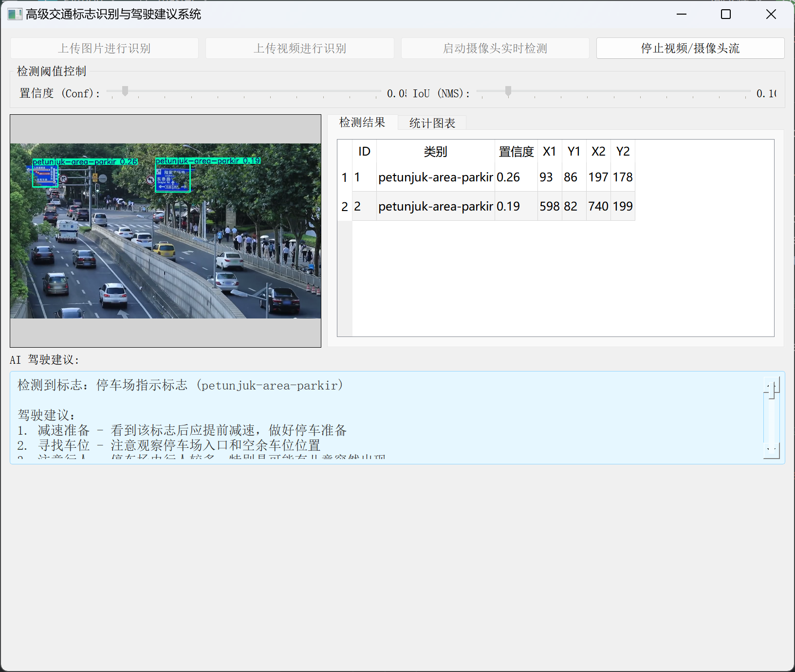
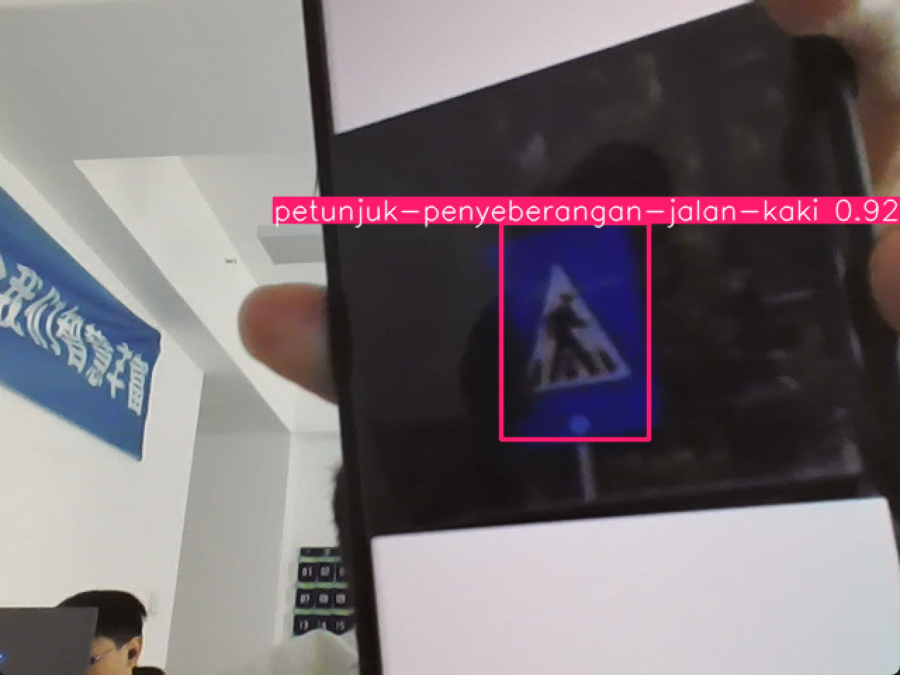
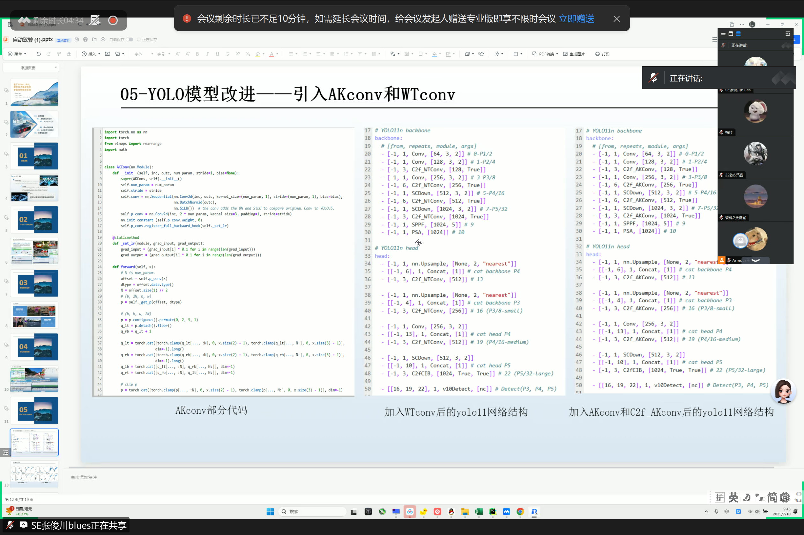

# Multi-Dimensional Road Condition Intelligent Driving Assistance System

### Based on YOLOv11 and Large Language Model (LLM)

> An advanced driver assistance system (ADAS) prototype that combines real-time YOLOv11 object detection with LLM-powered scene understanding and natural-language driving advice.

---

## Overview

This project was developed during a **18-day intensive production internship** at **Neusoft Education Technology Group** (June 19 – July 10, 2025). It integrates computer vision, deep learning, multi-threaded GUI programming, and large language model APIs into a unified desktop application capable of:

- Detecting **57 classes of traffic signs** plus **pedestrians & vehicles** in real time
- Generating **natural-language scene descriptions** and **personalized driving advice** via LLM
- Supporting **image, video file, and live camera** input sources
- Providing **voice broadcast**, **real-time statistics**, and **frame-by-frame analysis**

The system uses a **dual-model parallel detection architecture** — one YOLOv11 model fine-tuned for traffic signs and another for person/vehicle detection — running concurrently in a thread pool with a frame buffer queue for smooth real-time performance.

---

## Key Features

| Feature | Description |
|---|---|
| **Dual-Model Detection** | YOLOv11 for traffic signs (57 classes) + YOLOv11 for pedestrians/vehicles, running in parallel via `QThreadPool` |
| **LLM Scene Understanding** | DeepSeek-V3 generates scene descriptions, driving advice, Q&A responses, and summary reports based on live detection results |
| **Multi-Source Input** | Image files, video files (MP4/AVI/MOV), and real-time camera feed |
| **Multi-Threaded Architecture** | `QThread` for video capture + `QThreadPool` (4 workers) for inference + `QRunnable` for async LLM calls — GUI never blocks |
| **Frame Queue & FPS Control** | Bounded frame buffer (maxsize=10) with target FPS capping and frame-rate statistics |
| **Dynamic Thresholds** | Real-time confidence and IoU (NMS) threshold sliders to balance precision vs. recall |
| **Voice Broadcast** | `pyttsx3`-based text-to-speech queue for hands-free driving advice |
| **Statistics Dashboard** | Live category detection counts visualized with embedded `matplotlib` bar charts |
| **GPU Monitoring** | Real-time GPU utilization tracking via `GPUtil` |
| **Frame-by-Frame Mode** | Pause, resume, and step through video frames one at a time for detailed analysis |
| **Custom Model Variants** | Experimental YOLOv10 architectures with AKConv and WTConv modules for performance comparison |

---

## System Architecture

```
┌─────────────────────────────────────────────────────────────────┐
│                        PyQt5 GUI (Main Thread)                   │
│  ┌──────────────┐  ┌──────────────────┐  ┌───────────────────┐  │
│  │  Video View  │  │ Detection Tables │  │  LLM Advice Panel │  │
│  │  (OpenCV)    │  │  (signs + cars)  │  │ (scene / Q&A /    │  │
│  │              │  │                  │  │  report tabs)     │  │
│  └──────┬───────┘  └────────┬─────────┘  └────────┬──────────┘  │
│         │                   │                      │             │
│  ┌──────▼───────────────────▼──────────────────────▼──────────┐  │
│  │              Signal / Slot Communication Layer              │  │
│  └──────┬───────────────────┬──────────────────────┬──────────┘  │
└─────────┼───────────────────┼──────────────────────┼─────────────┘
          │                   │                      │
┌─────────▼──────┐  ┌────────▼─────────┐  ┌─────────▼──────────┐
│ DetectionThread │  │  AIWorker Pool   │  │  Speech Worker     │
│ (QThread)       │  │ (QRunnable x N)  │  │ (daemon thread)    │
│                 │  │                  │  │                    │
│ ┌─────────────┐ │  │ DeepSeek-V3 API  │  │ pyttsx3 TTS queue  │
│ │ Frame Queue │ │  │ async prompts    │  │                    │
│ │ (maxsize=10)│ │  │                  │  │                    │
│ └──────┬──────┘ │  └──────────────────┘  └────────────────────┘
│        │        │
│ ┌──────▼──────┐ │
│ │DetectionWkr │ │  ┌──────────────────────────────────────────┐
│ │(QRunnable)  │──┼─▶│ YOLOv11 Traffic Sign Model (57 classes) │
│ │ x 4 threads │ │  └──────────────────────────────────────────┘
│ └─────────────┘ │  ┌──────────────────────────────────────────┐
│                 │  │ YOLOv11 Person/Vehicle Model              │
│                 │  └──────────────────────────────────────────┘
└─────────────────┘
```

### Core Design Decisions

1. **Producer-Consumer Frame Queue**: The `DetectionThread` captures frames into a bounded queue (`maxsize=10`), while worker threads consume and process them. This prevents backpressure and keeps the GUI responsive.

2. **Thread-Safe Detection State**: Latest detection results are guarded by `threading.Lock` and rendered onto frames in the GUI thread, avoiding race conditions between inference and display.

3. **LLM Rate Limiting**: An `ai_busy` flag plus a 5-second analysis interval prevents API flooding. All LLM calls run in `QThreadPool.globalInstance()` as `QRunnable` tasks.

4. **Pause/Resume via Event Objects**: `threading.Event` (`pause_event`) enables efficient blocking pauses without busy-waiting, supporting both continuous and frame-by-frame modes.

---

## Tech Stack

| Category | Technology | Version / Notes |
|---|---|---|
| **Language** | Python | 3.10+ |
| **Deep Learning** | PyTorch + Ultralytics YOLOv11 | CUDA-enabled inference |
| **Object Detection** | YOLOv11 (custom fine-tuned) | 57-class traffic sign + 2-class person/vehicle |
| **GUI Framework** | PyQt5 | Signal/slot architecture, `QThread`, `QThreadPool` |
| **Computer Vision** | OpenCV (cv2) | Video I/O, frame processing, bounding box rendering |
| **LLM Integration** | OpenAI SDK → DeepSeek-V3 (SiliconFlow) | Async chat completions |
| **Visualization** | Matplotlib (embedded in Qt) | Real-time category statistics |
| **Text-to-Speech** | pyttsx3 | Offline TTS with queue-based dispatch |
| **GPU Monitoring** | GPUtil | Real-time utilization tracking |
| **Training** | Ultralytics `model.train()` | 150 epochs, imgsz=640, batch=4, AMP |

---

## Project Structure

```
yolov11-llm-adas/
├── README.md                    # This file
├── requirements.txt             # Python dependencies
├── .env.example                 # Environment variable template
├── .gitignore
├── src/
│   ├── main.py                  # Main application (PyQt5 GUI + detection + LLM)
│   ├── train.py                 # YOLOv11 training script
│   ├── configs/
│   │   ├── yolov10n_AKConv.yaml    # Experimental: AKConv backbone variant
│   │   └── yolov10_WTconv.yaml     # Experimental: WTConv + EAMA variant
│   └── modules/
│       ├── license_plate_recognition.py   # PaddleOCR-based license plate OCR
│       ├── vehicle_detection_haar.py      # Haar cascade vehicle detection
│       ├── image_processing_gui.py        # Tkinter image processing toolkit
│       ├── traffic_sign_enhanced.py       # Standalone traffic sign detection
│       └── object_tracking.py             # imutils-based motion tracking
├── weights/
│   ├── yolo11_traffic_sign.pt   # Fine-tuned YOLOv11 traffic sign detector
│   └── person_vehicle.pt        # YOLOv11 person/vehicle detector
├── assets/
│   ├── demo/                    # Screenshots and demo media
│   └── ui/                      # GUI icons and background images
├── docs/
│   ├── architecture.md          # Detailed system design
│   └── training.md              # Training methodology and results
└── samples/                     # Sample test images
```

---

## Demo

### Real-time Traffic Sign Detection with AI Driving Advice


The system simultaneously detects parking indication signs (bounding boxes with confidence scores), displays detailed results in a table, and generates personalized driving advice via LLM — all in real time.

### Live Camera Detection


Pedestrian crossing sign detected via live camera feed with 0.92 confidence.

### Model Architecture Exploration


Experimental YOLOv10 variants with AKConv (Asymmetric Convolution) and WTConv (Wavelet Transform Convolution) modules for improved feature extraction.

---

## Quick Start

### 1. Install Dependencies

```bash
pip install -r requirements.txt
```

### 2. Configure Environment Variables

Copy `.env.example` to `.env` and fill in your LLM API credentials:

```bash
cp .env.example .env
```

```env
LLM_API_KEY=your_api_key_here
LLM_BASE_URL=https://api.siliconflow.cn
LLM_MODEL=deepseek-ai/DeepSeek-V3
```

> The LLM feature is optional. Without an API key, the detection and visualization features still work fully.

### 3. Run the Application

```bash
cd src
python main.py
```

### 4. Using the Application

1. Click **"交通标识模型"** (Traffic Sign Model) and load `weights/yolo11_traffic_sign.pt`
2. Click **"行人车辆模型"** (Person/Vehicle Model) and load `weights/person_vehicle.pt`
3. Select input source: **Image**, **Video**, or **Camera**
4. Click **"开始检测"** (Start Detection)
5. Adjust confidence/IoU thresholds in real time with the sliders
6. View LLM-generated driving advice in the **"路况分析"** (Scene Analysis) tab

---

## Model Training

The traffic sign detection model was fine-tuned on a custom-labeled dataset of Chinese traffic signs using YOLOv11m:

```python
from ultralytics import YOLO

model = YOLO('yolo11m.yaml')
results = model.train(
    data='./TS/data.yaml',
    imgsz=640,
    epochs=150,
    batch=4,
    workers=16,
    amp=True,
    cache='ram',
    project='runs/V11train',
    name='exp'
)
```

Two experimental YOLOv10 architectures were also explored:
- **AKConv variant**: Replaces standard convolutions with Asymmetric Convolution Kernels for improved feature extraction
- **WTConv variant**: Incorporates Wavelet Transform Convolution and EAMA attention module

See [`docs/training.md`](docs/training.md) for detailed training methodology and hyperparameter analysis.

---

## Internship Context

This project was the culmination of an 18-day (108-hour) production internship covering:

| Week | Focus |
|---|---|
| **Week 1** | Python environment, OpenCV fundamentals, ML basics (KNN, SVM, Decision Trees), CNN with PyTorch/TensorFlow on MNIST/CIFAR-10 |
| **Week 2** | YOLO series deep dive, dataset preparation & labeling, traffic sign detection project, object tracking with imutils, Haar cascade & OCR |
| **Week 3** | Full system integration, LLM API integration, multi-threading optimization, testing & debugging, final defense presentation |

**Role**: Software Development Intern  
**Mentor**: Li Jianjun (Enterprise), Wang Kaijia (University)  
**Outcome**: Successfully delivered an integrated ADAS prototype with dual-model detection and LLM intelligence layer.

---

## Author

**Tianbo Hou (Peter)**  
- M.S. in Data Science, University of Southern California (2026 Fall)
- B.E. in Software Engineering, Hubei University of Technology (GPA 3.93/4.0)
- Experience: Tencent, Neusoft, WorldQuant, Sciencia AI

---

## License

This project is for educational and demonstration purposes. Third-party libraries retain their respective licenses.
